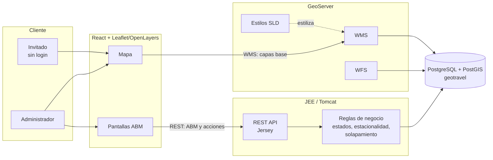

# Arquitectura

## Capas y quién las toca

| Capa | Tecnología | Módulo dueño |
|---|---|---|
| Datos | PostgreSQL + PostGIS (`db/migrations`) | P1 |
| Publicación de mapas | GeoServer (`geoserver/styles`) | P1 |
| API | JEE / Jersey (`backend/`) | P2 (base) + P3/P4/P5 (por módulo) |
| UI | React + Leaflet (`frontend/`) | P3/P4/P5 por módulo |

## Por qué las consultas complejas van por REST y no solo por WFS

Las 5 consultas geográficas (recorridos por zona, zonas más activas, recorrido
más cercano, zona por dirección, puntos populares) requieren joins entre
`zona_turistica`, `atraccion`, `recorrido` y `recorrido_atraccion` con
agregaciones — más flexible resolverlas como SQL directo en
`backend/.../consultas/ConsultaResource.java` que como `CQL_FILTER` de WFS.
El mapa "de fondo" (capas completas, coloreadas por SLD) sí sale directo de
GeoServer vía WMS — no hace falta backend para eso.
