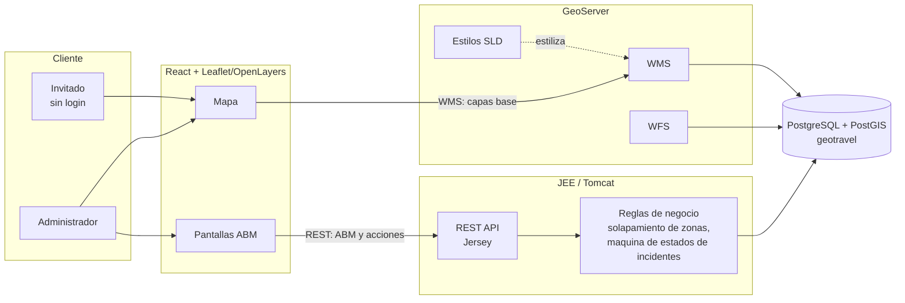
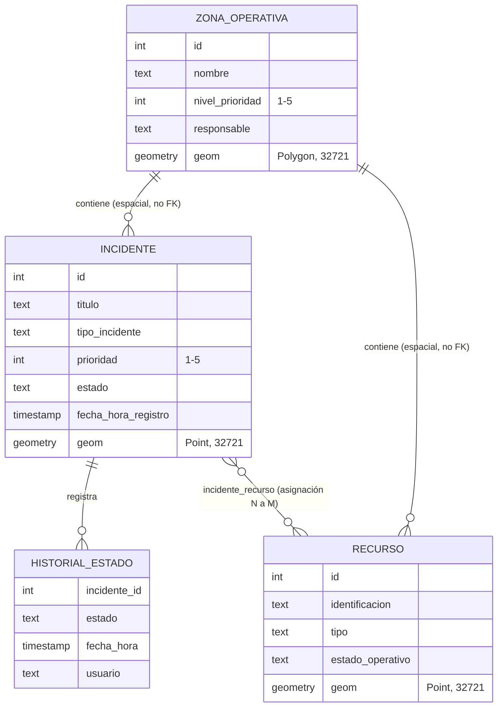
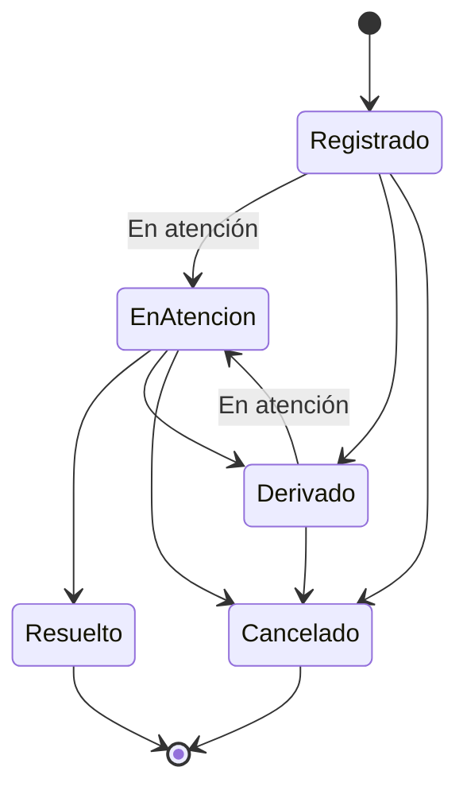

# Arquitectura

```mermaid
flowchart LR
    subgraph Cliente
        Invitado[Invitado<br/>sin login]
        Admin[Administrador]
    end

    subgraph Frontend[React + Leaflet/OpenLayers]
        Mapa[Mapa]
        ABM[Pantallas ABM]
    end

    subgraph Backend[JEE / Tomcat]
        API[REST API<br/>Jersey]
        Reglas[Reglas de negocio<br/>solapamiento de zonas,<br/>maquina de estados de incidentes]
    end

    subgraph GeoServer
        WMS[WMS]
        WFS[WFS]
        SLD[Estilos SLD]
    end

    DB[(PostgreSQL + PostGIS<br/>geotravel)]

    Invitado --> Mapa
    Admin --> Mapa
    Admin --> ABM

    Mapa -->|WMS: capas base| WMS
    ABM -->|REST: ABM y acciones| API

    API --> Reglas --> DB
    WMS --> DB
    WFS --> DB
    SLD -.estiliza.-> WMS
```

## Capas y quién las toca

| Capa | Tecnología | Módulo dueño |
|---|---|---|
| Datos | PostgreSQL + PostGIS (`db/migrations`) | P1 |
| Publicación de mapas | GeoServer (`geoserver/styles`) | P1 |
| API | JEE / Jersey (`backend/`) | P2 (base) + P3/P4/P5 (por módulo) |
| UI | React + Leaflet (`frontend/`) | P3/P4/P5 por módulo |

## Modelo de datos

```mermaid
erDiagram
    ZONA_OPERATIVA ||--o{ INCIDENTE : "contiene (espacial, no FK)"
    ZONA_OPERATIVA ||--o{ RECURSO : "contiene (espacial, no FK)"
    INCIDENTE ||--o{ HISTORIAL_ESTADO : "registra"
    INCIDENTE }o--o{ RECURSO : "incidente_recurso (asignación N a M)"

    ZONA_OPERATIVA {
        int id
        text nombre
        int nivel_prioridad "1-5"
        text responsable
        geometry geom "Polygon, 32721"
    }
    RECURSO {
        int id
        text identificacion
        text tipo
        text estado_operativo
        geometry geom "Point, 32721"
    }
    INCIDENTE {
        int id
        text titulo
        text tipo_incidente
        int prioridad "1-5"
        text estado
        timestamp fecha_hora_registro
        geometry geom "Point, 32721"
    }
    HISTORIAL_ESTADO {
        int incidente_id
        text estado
        timestamp fecha_hora
        text usuario
    }
```

`zona_operativa` no tiene relación de clave foránea con `incidente` ni con
`recurso` -- la pertenencia a una zona siempre se calcula espacialmente con
`ST_Contains`, no se guarda. Es la misma decisión que en GeoTravel (zonas
turísticas / recorridos).

## Máquina de estados de un incidente

```mermaid
stateDiagram-v2
    [*] --> Registrado
    Registrado --> EnAtencion: En atención
    Registrado --> Derivado
    Registrado --> Cancelado
    EnAtencion --> Resuelto
    EnAtencion --> Derivado
    EnAtencion --> Cancelado
    Derivado --> EnAtencion: En atención
    Derivado --> Cancelado
    Resuelto --> [*]
    Cancelado --> [*]
```

**SUPUESTO a confirmar con el tutor:** la letra solo da un ejemplo lineal
("Registrado → En atención → Resuelto") y menciona que existen derivación y
cancelación, sin especificar desde qué estados se puede llegar a cada una.
Este diagrama es la interpretación usada en `IncidenteResource.java`
(constante `TRANSICIONES`) -- si el tutor confirma otra cosa, es el único
lugar del backend que hay que tocar.

## Por qué las consultas complejas van por REST y no solo por WFS

Las consultas geográficas (incidentes por zona, zonas con más incidentes,
recursos cercanos a un incidente, etc.) requieren joins entre
`zona_operativa`, `incidente`, `recurso` e `incidente_recurso` con
agregaciones — más flexible resolverlas como SQL directo en
`backend/.../consultas/ConsultaResource.java` que como `CQL_FILTER` de WFS.
El mapa "de fondo" (capas completas, coloreadas por SLD) sí sale directo de
GeoServer vía WMS — no hace falta backend para eso.
